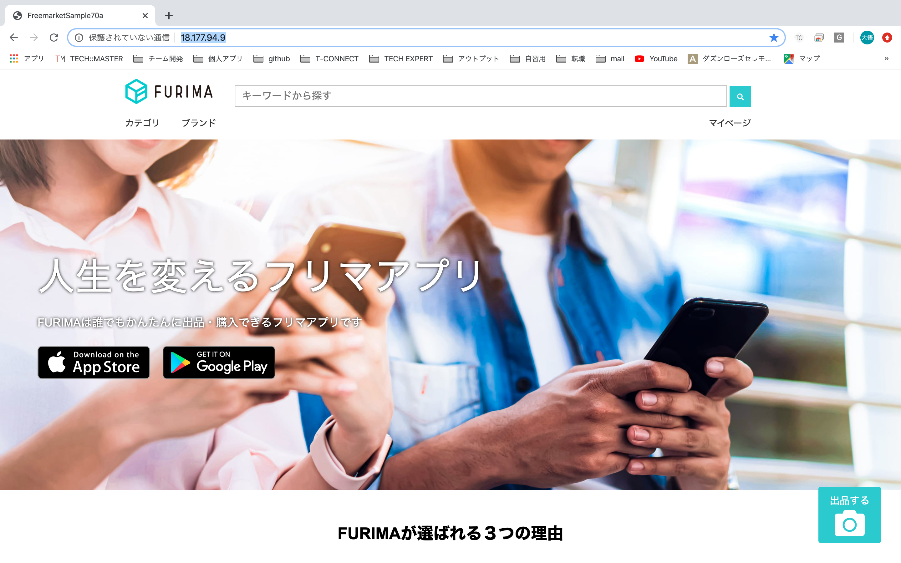
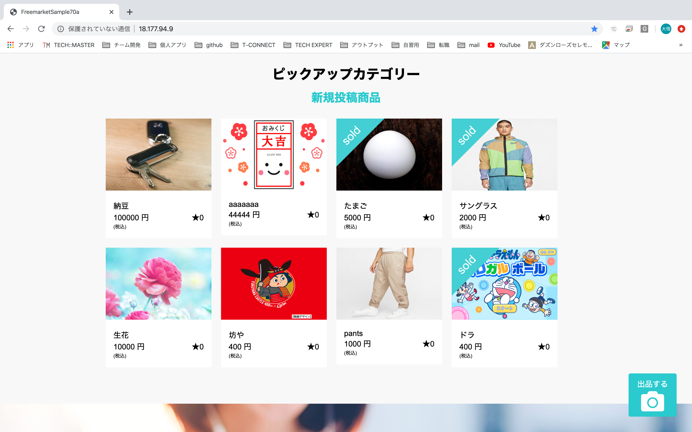
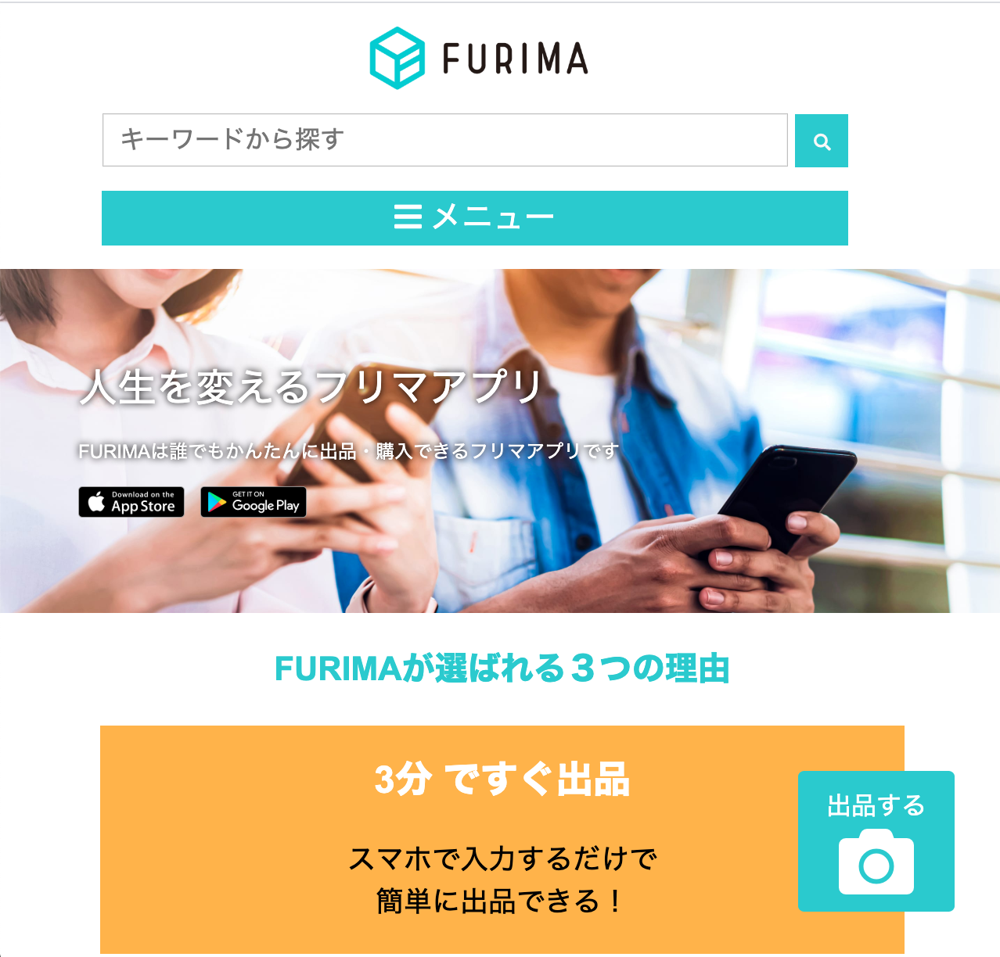
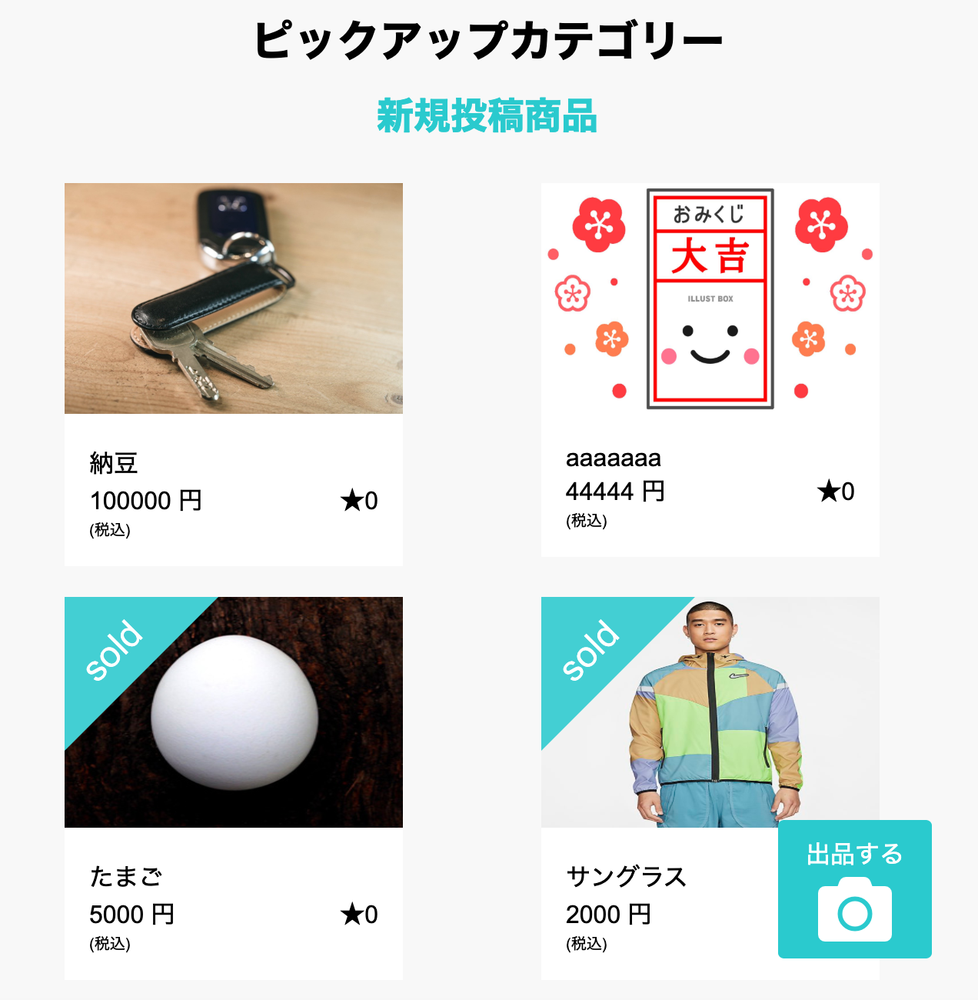
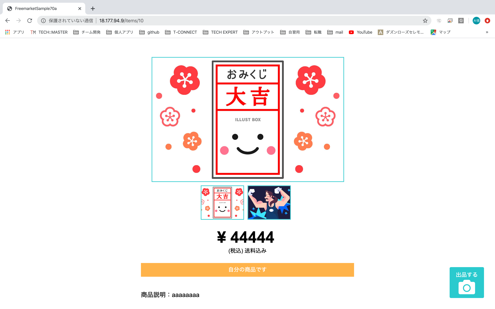
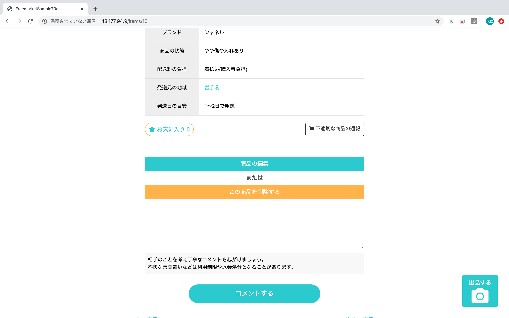
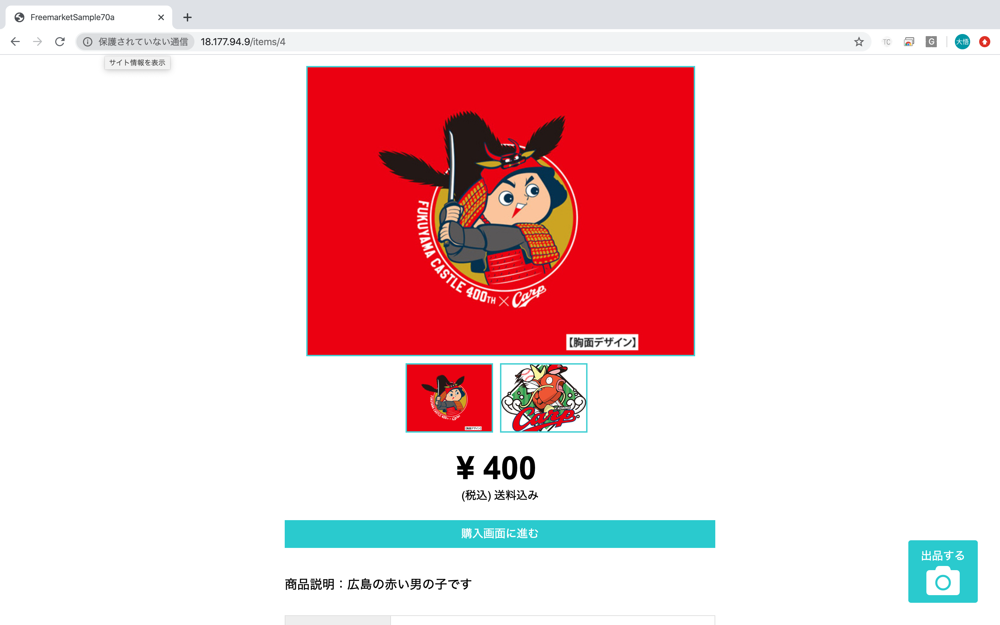
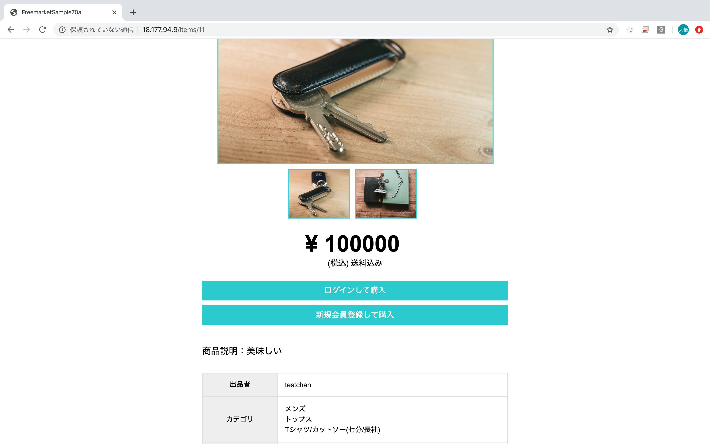

# README

# 概要
テックキャンプの最終課題にて作成したフリーマーケットアプリケーション。

# 開発状況
開 発 環 境：Ruby/Ruby on Rails/MySQL/Github/AWS/Visual Studio Code/haml&Scss 
開 発 期 間：約4週間 
平均作業時間：約9時間 
開 発 体 制：人数4名、アジャイル型開発（スクラム）、Trelloによるタスク管理

# 本番環境
URL http://18.177.94.9/

ID: admin 
Pass: 2222

テスト用アカウント 
<購入者用> 
 ▶︎メールアドレス: buyer_user@gmail.com 
 ▶︎パスワード: buyer_user 
 ▶︎購入用カード情報／番号：4242424242424242／期限：12/20／セキュリティコード：123 
<出品者用<> 
 ▶︎メールアドレス名: seller_user@gmail.com 
 ▶︎パスワード: seller_user 

# 動作確認方法
Chromeの最新版を利用してアクセスしてください。ただしデプロイ等で接続できないタイミングもございます。その際は少し時間をおいてから接続ください。

接続先およびログイン情報については、上記の通りです。なお、同時に複数の方がログインしている場合に、ログインできない可能性がございます。

●出品方法は以下の手順で確認できます 
テストアカウントでログイン→トップページから出品ボタン押下→商品情報入力→商品出品

●購入方法は以下の手順で確認できます 
テストアカウントでログイン→トップページ下部から商品選択→商品購入

●確認後、ログアウト処理をお願いします。

# 開発担当箇所
## 担当箇所一覧

デプロイ、本番環境関連

フロントエンド 
１）トップページ(最終調整) 

  
  
  
    

２）商品詳細ページ 
  購入用アカウントでログイン後、トップページ商品一覧の左上の商品をクリックするとご覧いただけます。

  
  

サーバーサイド 
１）商品詳細表示 
  出品時に登録された商品の情報及び編集ページで変更された商品の情報を商品詳細ページに反映。なお「売れていなければ購入できる」「出品者は購入ができない」「売れていれば購入できない」「ログインしていなければ購入できない」ようになっています。 

  
  
  

２）商品削除機能 
  商品詳細ページで「商品を投稿したユーザーだけ」が商品の情報を削除することができます。 
３）商品編集機能 
  商品詳細ページで「商品を投稿したユーザーだけ」が商品の情報を編集することができます。なお「売れた商品は編集ができない」ようになっています。 
４）商品出品機能 
  商品出品ページで「ログインしているユーザーだけ」が商品を登録できます。 

## 各担当箇所の詳細

▶︎ デプロイ、本番環境関連 
<概要> 
アプリケーションをEC2のサーバにデプロイし全世界に公開状態にする 
使用技術はAWS、Ruby on Rails（5.2系） 
<担当内容> 
基本となるroutes、controller、modelの設置 
carrierwaveというgemを使って画像のアップロードを実装 
Capistranoを利用した自動デプロイ 
S3の導入 
basic認証の実装 
本番環境でのテスト、エラー解決 

▶︎ トップページ（商品新着一覧ページ） 
<概要> 
新着順に商品が一覧表示されるページ 
商品検索、カテゴリ検索が可能 
<担当内容（フロントエンド）> 
マークアップ後および各機能実装後のデザイン調整 
スマホ／タブレット／PCで切り替えるレスポンシブデザイン 
ログインすると出現する出品ボタンの設置 

▶︎ 商品詳細ページ 
<概要> 
出品されている商品の詳細が表示されるページ 
<担当内容（フロントエンド）> 
haml＆scssを使用してのページのコーディング 
<担当内容（サーバーサイド）> 
出品機能で登録または編集機能で変更された内容を表示させるためのルーティング、コントローラーの設定 
ビューで購入に関する条件分岐を実装し、適切なリンクボタンを設置した。内容は以下の通り 
・ログインしていなければ購入ができない 
・出品者は自分が出品した商品を購入できない 
・売れていなければ購入できる 
・売れていなければ購入できない 
ビューで編集、削除に関する条件分岐を実装し、適切なリンクボタンを設置した。内容は以下の通り 
・出品者のみ編集、削除ができる 
・購入済の商品は編集ができない 
削除機能を実装するためのルーティング、コントローラーの設定

▶︎ 商品編集ページ 
<概要> 
登録した商品の情報を変更できる 
商品出品時とほぼ同じUIで実装 
画像やカテゴリーの情報など、すでに登録されている商品情報は編集画面を開いた時点でもれなく表示される 
<担当内容（フロントエンド）> 
haml＆scssを使用してのページのコーディング 
<担当内容（サーバーサイド）> 
編集、変更を行うためのルーティング、コントローラーの設定 
単体テスト

▶︎ 商品出品ページ 
<概要> 
出品する商品の情報を登録できる 
<担当内容（サーバーサイド）> 
activehashというgemを使ってのプルダウン表示選択機能実装 
モデルの設定（アソシエーション、バリデーション）

# DEMO

# 開発を通じて得られた知見
## 工夫した点
●チームとして工夫を行った点 
 １）基本的にマークアップを行ったメンバーがサーバーサイド側の実装も行うことで、スムーズに作業を進めることができました。 
 ２）作業量の多い商品出品機能をブランチから子ブランチを派生させて、画像投稿、カテゴリ表示、アクティブハッシュをそれぞれ別のメンバーが実装しました。これにより滞っていた進捗が改善されるとともに、その部分でエラーや不具合があったときに実装したメンバーが格となることで早く解決することができました。 
 ３）完成した機能を本番環境にデプロイした際は、必ず各自でチェックをするようにしました。エラーはもちろん、条件分岐で甘いところなど、お互いにきちんと指摘しあうことをチームの指針の１つとしていたことが非常によかったです。 

●個人として工夫を行った点 
 １）開発しているブラウザアプリを指示通りに実装するのではなく、より使いやすくするにはどうすればいいかを常に考えました。例えば、ログインをしなければ出品できなかったり、購入された商品は編集できないといった条件分岐・エラーハンドリングの追加やスマホ・タブレットでも使えるようにレスポンシブデザイン対応に取り組みました。 
 ２）データベース設計の担当ではなかったが、acctivehashというgemを複数項目に活用すれば設計がシンプルになることを提案。実装にも取り組みました。 
 ３）リモートへ新しい機能をマージして本番環境へデプロイを行うたびに、追加した機能だけではなく実装済みの機能も問題なく動くかテストを行いました。理由はコンフリクト解消の際のうっかり削除ミスやマージしたブランチの古い情報が上書きされている可能性を調査するためで、これによりデプロイ後に起きたエラーの原因を特定しやすくなりました。 

## 苦労した点
１）デプロイ・本番環境でのエラー解決 
 開発前、AWSを用いてのデプロイは1度しか経験がなく、しかもrails5.0系でのカリキュラムであったため、master.key設定など初めて取り組むことも多かったです。しかし、設定をしていく中で行き詰まることもあったが、その度に解決方法を調べ、学ぶことでデプロイの理解度を深めることができました。また、本番環境でエラーが起きた際もログを確認してエラー解決を図ることができるようになり、苦手だったLinuxコマンドをもっと学びたいと思うようになりました。

２）Github 
 サーバーサイドは様々な機能を並行して実装するという開発スタイルをとっていたため、コンフリクトの発生率が高い期間がありました。そこで、私がコンフリクト解消の担当となり、チームメンバーと情報を共有しながら解消していくことでスムーズな解消につながりました。何度も解消するうちにコンフリクトだけでなくgit、githubに関する理解も深めることができました。
 また、プルリクエスト時のコンフリクトや本番環境でのをエラー発生を極力減らすために、新しい機能がマージされたらブランチにリモートの最新データを反映させるようにし、ローカル環境で不具合に対処するように改善しました。

３）チーム内の情報共有 
 チームの指針として午前と夕方2回のデイリースクラムを実施し、情報の共有を行っていましたが、実装していることや発生しているエラーについてなど必要最低限のことだけを伝えていたため、メンバーが実装したこと・エラー解消したことの活用ができていませんでした。そこでコーディングしているMVCや使用技術、エラーの状況などを正確かつ簡潔に伝えることを心がけたことでコンフリクトの予測やエラーの早期解消につなげることができました。

４）社会人経験のないメンバーの認識のズレとモチベーション維持 
 私たちのチームは社会人経験ありが3名、なしが1名というメンバー構成でした。その中で苦労したのが社会人経験のないメンバーAさんの「チーム開発」への認識のズレでした。Aさんはよく言えば「学習」、悪く言えばサークルのような感覚でチーム開発に参加していましたが残りのメンバーは「模擬業務」として行っており、認識のズレが生じていました。 
 また、Aさんの基礎理解度も低く、チーム開発を「わからなければ誰かが解決してくれる」と思い込んでおり、最終的に実装できずに本人のモチベーションが低下し、進捗が著しく低下する事態に陥りました。 
 そこで、これまでの職務で培ったマネジメント経験を生かし、チームの指針として「1時間悩んでわからなかったらチームメンバーに共有」などAさんに自分で頑張ってもらいつつ、いつでもフォローができる状況を構築。飴とムチ作戦でAさんのモチベーションを維持しながら、認識のズレを修正していきました。進捗率のいいメンバーが日替わりでメンターのような役割を行ったほか、滞っていた商品出品機能の一部を残りのメンバーで手分けして実装することで進捗を改善。Aさんフォローの際も自分の理解を深める時間として取り組み、MVCの理解度などをより深めることができました。

# DB設計

## usersテーブル
|Column|Type|Options|
|------|----|-------|
|nickname|string|null: false|
|mail|string|null: false, unique: true, index: true|
|password|string|null: false|
|first_name|string|null: false|
|last_name|string|null: false|
|first_kana|string|null: false|
|first_kana|string|null: false|
|birth_year|integer|null: false|
|birth_month|integer|null: false|
|birth_day|integer|null: false|

### Assosiation
- has_one :credit_card, dependent: :destroy
- has_one :sending_destination, dependent: :destroy
- has_many :buyer_items, foreign_key: "buyer_id", class_name: "items"
- has_many :seller_items, foreign_key: "seller_id", class_name: "items"
- has_many :comments

## credit_cardsテーブル
|Column|Type|Options|
|------|----|-------|
|user_id|integer|null: false|
|customer_id|string|null: false|
|card_id|string|null: false|

### Assosiation
- belongs_to :user

## sending_destinationsテーブル
|Column|Type|Options|
|------|----|-------|
|post_code|string|null: false|
|prefecture|string|null: false|
|city|string|null: false|
|house_number|string|null: false|
|building_name|string|
|phone_number|string|null: false|
|user|references|null: false, foreign_key: true|

### Assosiation
- belongs_to :user

## commentsテーブル
|Column|Type|Options|
|------|----|-------|
|body|text|
|user|references|null: false, foreign_key: true|
|item|references|null: false, foreign_key: true|

### Assosiation
- belongs_to :user
- belongs_to :item

## itemsテーブル
|Column|Type|Options|
|------|----|-------|
|name|string|null: false|
|price|integer|null: false|
|item_description|string|
|item_condition_id|integer|null: false, foreign_key: true|
|postage_payer_id|integer|null: false, foreign_key: true|
|preparation_day_id|integer|null: false, foreign_key: true|
|prefecture_id|integer|null: false, foreign_key: true|
|buyer|references|foreign_key: true|
|seller|references|null: false, foreign_key: true|
|category|references|null: false, foreign_key: true|
|brand|integer|foreign_key: true|
|image|references|null: false, foreign_key: true|

### Assosiation
- has_many :item_images, dependent: :destroy
- has_many :comments, dependent: :destroy
- belongs_to :category
- belongs_to :seller, class_name: "User"
- belongs_to :buyer, class_name: "User"
- belongs_to_active_hash :item_condition
- belongs_to_active_hash :postage_payer
- belongs_to_active_hash :preparation_day
- belongs_to_active_hash :prefecture
- belongs_to_active_hash :brand

## categoriesテーブル
|Column|Type|Options|
|------|----|-------|
|name|string|null: false|
|ancestry|string|null: false|

### Assosiation
- has_many :items
- has_ancestry

## item_imagesテーブル
|Column|Type|Options|
|------|----|-------|
|image|text|null: false|
|item|references|null: false, foreign_key: true|

### Assosiation
- belongs_to :item

gem => 'active_hash',  'ancestry'